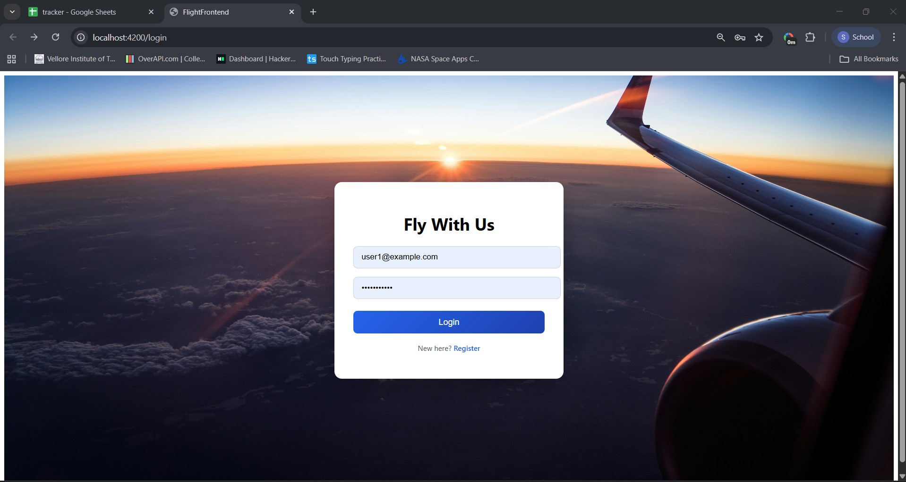
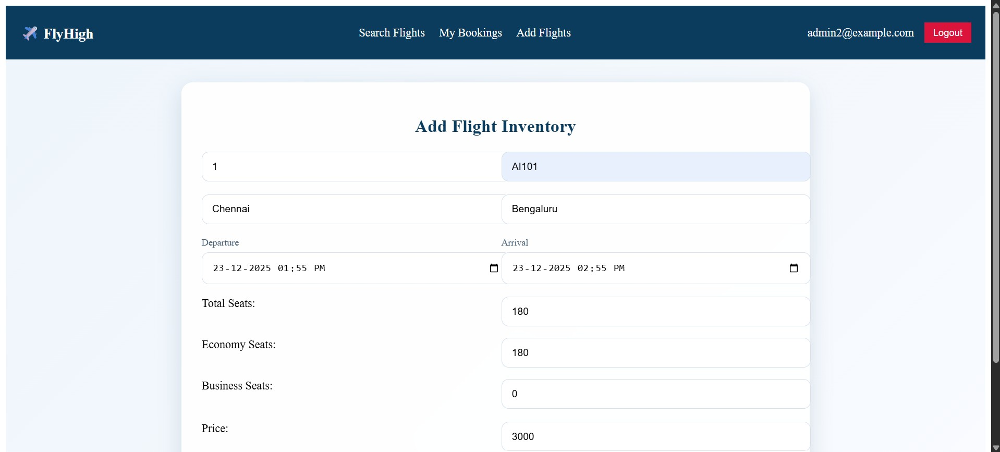
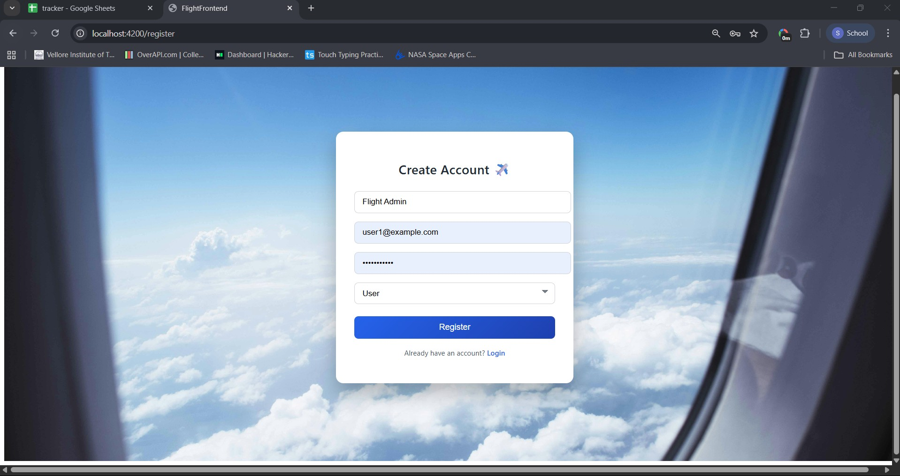
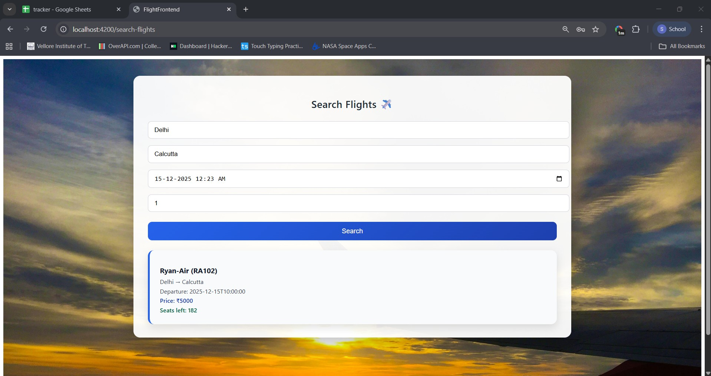
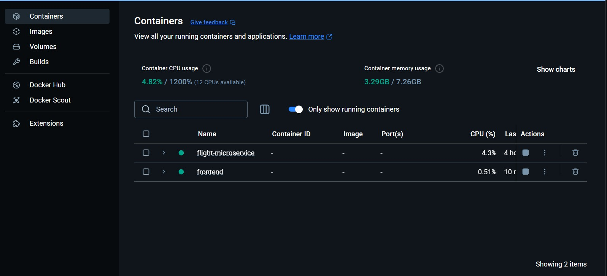
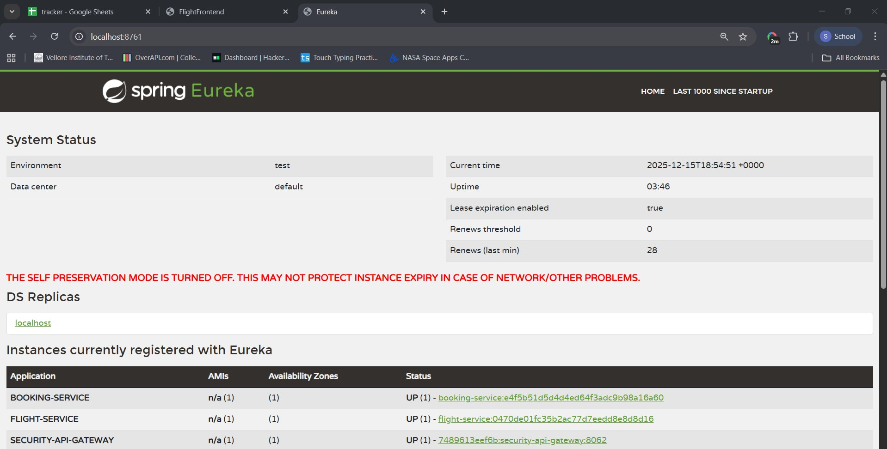

# ✈️ Flight Management System – Angular Frontend
## End to End Containerized Full stack flight management system using docker
## Angular frontend is present in frontend/flight-frontend
This repository contains the **Angular frontend** for a Flight Management System  built on top of a **Spring Boot microservices backend** exposed via an **API Gateway**.


## Login Page


## From the backend i am getting a json of user role type on signin , it helps me get automatic role of user based on login details admin/ user
## Add flight , available to only admin login users


## View and delete booking page available to all logged in user


## 

## Registration Page


## Flight Search Page


## Dockerized Frontend 


## Dockerized Microservices Architecture



The frontend is responsible for:
- User authentication (login & register)
- JWT handling on the client side
- Flight search
- Route protection
- Clean communication with backend services

# Run my frontend in your docker !!
```shell
docker pull sohamc2003/flight-frontend
```

---

## 🧱 Tech Stack

### Frontend
- Angular (Standalone Components)
- Angular Router
- HttpClient
- Functional Route Guards
- Functional HTTP Interceptors

### Backend (context)
- Spring Cloud Gateway
- Spring Security + JWT
- Flight Service
- Booking Service
- Eureka Discovery Server

---

## 📁 Project Structure

```

src/
│
├── app/
│   ├── core/
│   │   ├── services/
│   │   │   ├── auth.service.ts
│   │   │   └── flight.service.ts
│   │   │
│   │   ├── guards/
│   │   │   └── auth.guard.ts
│   │   │
│   │   └── interceptors/
│   │       └── auth.interceptor.ts
│   │
│   ├── components/
│   │   ├── login/
│   │   ├── register/
│   │   └── search-flights/
│   │
│   ├── app.routes.ts
│   └── app.component.ts
│
├── proxy.conf.json
└── angular.json

```

---

## 🧠 Architectural Responsibilities

### Components (`components/`)
- Handle UI and user interactions
- Collect form inputs
- Call services
- Display backend responses

Components **do not**:
- Make raw HTTP calls
- Attach auth headers
- Handle authentication logic

---

### Services (`core/services/`)

#### AuthService
- Calls `/auth/login` and `/auth/register`
- Stores JWT token in `localStorage`
- Provides token access for guards and interceptors

#### FlightService
- Calls flight-related backend APIs
- Abstracts API URLs from components

Services exist so that:
- API logic is centralized
- URLs can change in one place
- Components remain clean and focused

---

### Route Guard (`auth.guard.ts`)
- Runs before route navigation
- Checks if JWT token exists
- Redirects unauthenticated users to `/login`

This prevents users from opening protected pages without logging in.

---

### HTTP Interceptor (`auth.interceptor.ts`)
- Runs automatically for every outgoing HTTP request
- Reads JWT token from `localStorage`
- Attaches `Authorization: Bearer <token>` header

This avoids manually adding headers in every service and keeps authentication centralized.

---

## 🔁 Data Flow Example (Flight Search)

```

User clicks Search Flights
↓
SearchFlightsComponent
↓
FlightService.searchFlights()
↓
HTTP Interceptor adds JWT
↓
API Gateway
↓
Flight Service
↓
Response returned
↓
Component updates UI

````

---

## 🔐 Authentication Flow

### Login
1. User enters email and password
2. LoginComponent calls AuthService.login()
3. Backend validates credentials
4. JWT token returned
5. Token stored in localStorage
6. User redirected to flight search page

### After Login
- Guard allows access to protected routes
- Interceptor attaches JWT to all API requests
- Backend validates token on each request

---

## 🌐 CORS Handling

### Problem
Browser enforces CORS when frontend (`localhost:4200`) directly calls backend (`localhost:8062`).

### Solution Used: Angular Proxy

Instead of calling backend directly:
```ts
http://localhost:8062/api/...
````

The app uses relative URLs:

```ts
/api/v1.0/flight/search
```

Requests are forwarded using `proxy.conf.json`:

```json
{
  "/api": {
    "target": "http://localhost:8062",
    "secure": false,
    "changeOrigin": true
  },
  "/auth": {
    "target": "http://localhost:8062",
    "secure": false,
    "changeOrigin": true
  }
}
```

### Why this works

* Browser sees all requests as same-origin
* Angular dev server forwards them to API Gateway
* CORS is completely avoided during development
* Backend CORS config remains for production

---

## 🚦 Backend Context (API Gateway)

Although backend code is not in this repo, the frontend relies on the API Gateway for:

* Routing requests to microservices
* JWT validation
* Role-based authorization
* Centralized security and CORS

Frontend never talks to microservices directly.

---

## ✅ Key Design Decisions

* Standalone components instead of NgModules
* Functional guards and interceptors
* Services with `providedIn: 'root'`
* API Gateway as single backend entry point
* Proxy-based CORS handling in development

---

## 🧠 Mental Model

> Components handle interaction
> Services handle communication
> Guards protect navigation
> Interceptors protect requests
> Backend enforces truth

---

## ▶️ How to Run

```bash
npm install
ng serve
```

